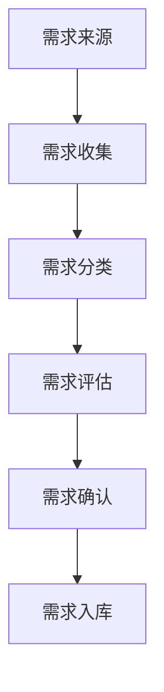
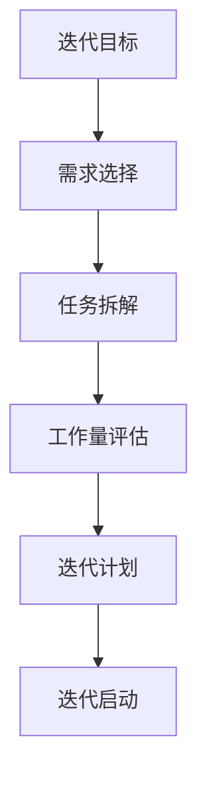
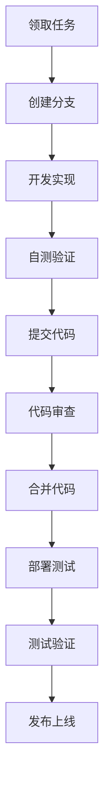
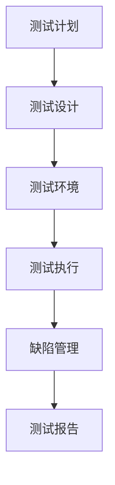
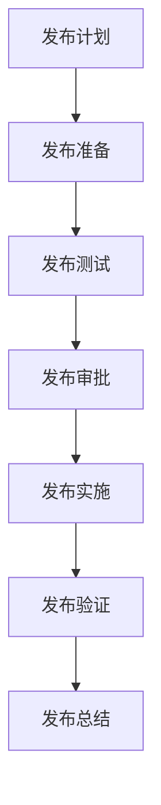
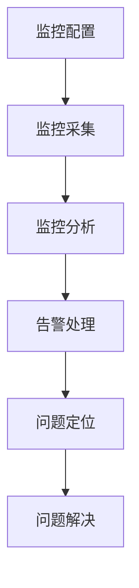
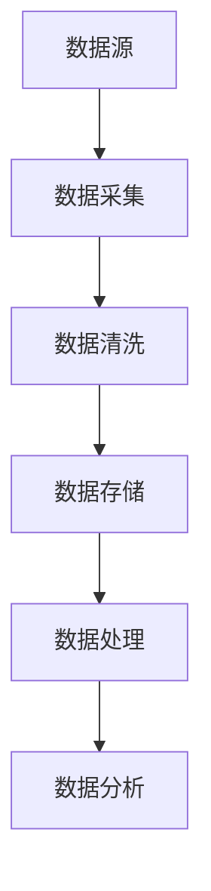
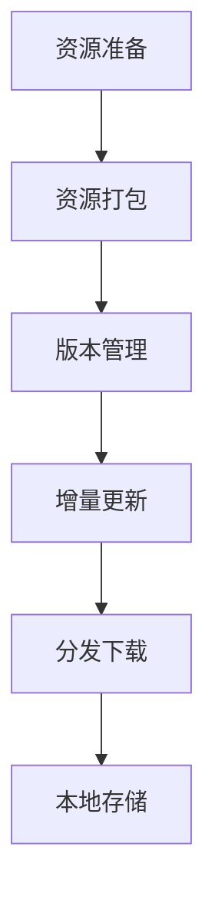

# GameHub 工作流程

## 1. 需求管理流程

### 1.1 需求收集

#### 需求来源
- **用户反馈**：通过用户调研、反馈渠道收集
- **市场分析**：通过竞品分析、行业趋势分析
- **业务需求**：来自运营、市场、商务等部门
- **技术需求**：来自技术团队的技术改进建议
- **产品规划**：来自产品战略规划

#### 需求分类
- **功能需求**：新功能开发、功能优化
- **性能需求**：性能优化、响应速度提升
- **体验需求**：用户体验改进、界面优化
- **技术需求**：架构优化、技术升级
- **运营需求**：运营工具、数据分析

### 1.2 需求分析
- **需求澄清**：明确需求背景、目标和范围
- **需求拆解**：将复杂需求拆解为可执行任务
- **需求评估**：评估需求价值、难度和优先级
- **需求评审**：组织需求评审会议，达成共识
- **需求确认**：与需求方确认需求细节

### 1.3 需求管理
- **需求文档**：编写详细的需求文档
- **需求跟踪**：使用工具跟踪需求状态
- **需求变更**：管理需求变更流程
- **需求验证**：验证需求实现效果
- **需求归档**：完成需求后进行归档

## 2. 开发工作流程

### 2.1 迭代规划

#### 迭代周期
- **迭代周期**：2周为一个迭代周期
- **迭代计划**：每个迭代开始前进行计划会议
- **迭代评审**：每个迭代结束后进行评审会议
- **迭代回顾**：每个迭代结束后进行回顾会议

#### 任务管理
- **任务拆解**：将需求拆解为具体开发任务
- **任务分配**：根据团队能力和优先级分配任务
- **任务跟踪**：使用项目管理工具跟踪任务进度
- **任务验收**：完成任务后进行验收和测试

### 2.2 开发流程

#### 开发环境
- **本地开发**：搭建本地开发环境
- **开发工具**：统一开发工具和配置
- **代码规范**：遵循代码规范和最佳实践
- **版本控制**：使用Git进行版本控制

#### 代码质量
- **代码审查**：所有代码必须经过审查
- **自动化测试**：编写单元测试和集成测试
- **静态分析**：使用工具进行代码静态分析
- **性能测试**：关键功能进行性能测试

## 3. 测试工作流程

### 3.1 测试策略

#### 测试类型
- **单元测试**：开发人员编写，覆盖核心逻辑
- **集成测试**：测试模块间交互和数据流
- **系统测试**：测试完整功能和用户场景
- **性能测试**：测试系统性能和负载能力
- **安全测试**：测试系统安全性和漏洞

#### 测试环境
- **测试环境**：独立的测试环境，模拟生产环境
- **测试数据**：使用模拟数据，保护用户隐私
- **测试工具**：使用自动化测试工具提高效率
- **测试报告**：生成详细的测试报告

### 3.2 缺陷管理
- **缺陷报告**：使用标准模板报告缺陷
- **缺陷分类**：根据严重程度和优先级分类
- **缺陷分配**：合理分配缺陷给开发人员
- **缺陷跟踪**：跟踪缺陷处理进度
- **缺陷验证**：验证缺陷修复效果

## 4. 发布工作流程

### 4.1 发布准备

#### 发布类型
- **功能发布**：新功能上线
- **优化发布**：性能优化和体验改进
- **修复发布**：缺陷修复和安全更新
- **紧急发布**：紧急问题修复

#### 发布策略
- **灰度发布**：逐步扩大发布范围
- **蓝绿部署**：无缝切换部署方式
- **回滚策略**：制定快速回滚方案
- **监控告警**：实时监控系统状态

### 4.2 发布流程
- **发布计划**：制定详细的发布计划
- **发布准备**：准备发布所需的资源和环境
- **发布测试**：在预生产环境进行发布测试
- **发布审批**：获得发布审批后执行发布
- **发布实施**：按照计划执行发布操作
- **发布验证**：验证发布效果和系统稳定性
- **发布总结**：总结发布经验和问题

## 5. 运维工作流程

### 5.1 监控管理

#### 监控范围
- **系统监控**：服务器资源使用情况
- **应用监控**：应用性能和错误情况
- **业务监控**：关键业务指标变化
- **安全监控**：安全事件和异常行为
- **用户监控**：用户体验和行为分析

#### 告警机制
- **告警规则**：设置合理的告警规则和阈值
- **告警通知**：通过多种渠道发送告警通知
- **告警分级**：根据严重程度分级处理告警
- **告警响应**：制定告警响应流程和责任人

### 5.2 故障处理
- **故障发现**：通过监控和用户反馈发现故障
- **故障定位**：快速定位故障原因和影响范围
- **故障处理**：采取紧急措施恢复系统服务
- **故障分析**：分析故障根本原因
- **故障预防**：制定预防措施避免类似故障

## 6. 数据工作流程

### 6.1 数据收集

#### 数据来源
- **用户行为数据**：用户操作和行为记录
- **业务数据**：业务流程和交易数据
- **系统数据**：系统运行和性能数据
- **第三方数据**：外部数据源和API数据
- **日志数据**：系统日志和访问日志

#### 数据处理
- **数据清洗**：处理缺失值、异常值和重复值
- **数据转换**：转换数据格式和结构
- **数据整合**：整合多源数据
- **数据计算**：计算指标和衍生数据
- **数据存储**：存储处理后的数据

### 6.2 数据分析
- **描述分析**：分析数据分布和特征
- **诊断分析**：分析问题原因和影响因素
- **预测分析**：预测未来趋势和变化
- **决策分析**：支持业务决策和优化
- **可视化**：使用图表展示分析结果

## 7. 离线功能工作流程

### 7.1 离线资源管理

#### 资源准备
- **资源筛选**：选择适合离线的游戏资源
- **资源优化**：优化资源大小和加载性能
- **资源打包**：将资源打包为离线包
- **资源加密**：对资源进行加密保护
- **资源签名**：对资源进行数字签名

#### 版本管理
- **版本控制**：管理资源版本和更新历史
- **差异计算**：计算版本间的差异内容
- **增量包**：生成增量更新包
- **版本验证**：验证资源版本完整性
- **版本回滚**：支持版本回滚机制

### 7.2 离线下载流程
- **下载队列**：管理用户下载任务队列
- **断点续传**：支持下载中断后继续下载
- **并发控制**：控制并发下载数量和速度
- **存储管理**：管理本地存储空间使用
- **下载统计**：统计下载成功率和速度

### 7.3 离线使用流程
- **离线检测**：检测网络状态和离线权限
- **资源加载**：从本地存储加载游戏资源
- **数据同步**：联网后同步用户数据和进度
- **权限验证**：验证用户离线使用权限
- **使用统计**：统计离线功能使用情况

## 8. 协作沟通流程

### 8.1 会议管理
- **每日站会**：每日同步进度和问题
- **周例会**：每周总结进展和计划
- **月度回顾**：每月回顾成果和改进
- **季度规划**：每季度制定目标和计划
- **年度总结**：每年总结成果和规划

### 8.2 沟通工具
- **即时通讯**：使用即时通讯工具进行日常沟通
- **项目管理**：使用项目管理工具跟踪任务
- **文档协作**：使用文档协作工具编写文档
- **代码协作**：使用代码托管平台协作开发
- **视频会议**：使用视频会议工具进行远程会议

### 8.3 知识管理
- **知识库**：建立团队知识库
- **经验分享**：定期分享经验和最佳实践
- **培训学习**：组织技术培训和分享
- **文档管理**：统一管理和维护文档
- **问题解决**：记录和分享问题解决方案

---

## 流程优化

本工作流程将根据项目发展和团队反馈持续优化和完善，确保团队协作高效、项目交付高质量。

**生效日期**：2023年12月
**版本号**：v1.0