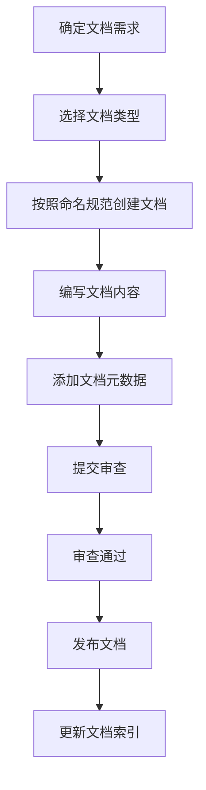
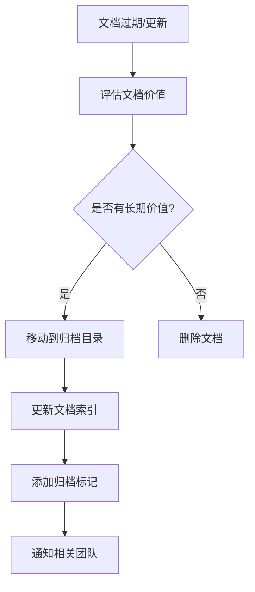

# GameHub 文档管理规范

## 1. 文档分类与目录结构

### 1.1 文档分类
项目文档按照以下类别进行分类：

- **宪章文档**：项目宪章、开发规范、工作流程等核心文档
- **产品文档**：产品需求、功能设计、用户研究等
- **技术文档**：技术架构、API文档、数据库设计等
- **项目文档**：项目计划、进度报告、会议纪要等
- **运营文档**：运营策略、数据分析、用户反馈等
- **归档文档**：历史版本、过期文档、参考资料等

### 1.2 目录结构
```
docs/
├── 01-宪章文档/               # 核心规范文档（引用constitution目录）
│   └── README.md             # 宪章文档索引
├── 02-产品文档/               # 产品相关文档
│   ├── 需求文档/
│   ├── 设计文档/
│   └── 用户研究/
├── 03-技术文档/               # 技术相关文档
│   ├── 架构设计/
│   ├── API文档/
│   ├── 数据库设计/
│   └── 技术方案/
├── 04-项目文档/               # 项目管理文档
│   ├── 项目计划/
│   ├── 进度报告/
│   └── 会议纪要/
├── 05-运营文档/               # 运营相关文档
│   ├── 运营策略/
│   ├── 数据分析/
│   └── 用户反馈/
├── 06-归档文档/               # 历史和归档文档
│   ├── 历史版本/
│   └── 参考资料/
└── README.md                 # 文档中心索引
```

## 2. 文档命名规范

### 2.1 命名规则
文档命名遵循以下规则：
- **格式**：`[日期]_[类型]_[标题]_[版本].md`
- **日期**：使用YYYY-MM-DD格式
- **类型**：使用文档类型缩写
- **标题**：使用中文或英文，简洁明确
- **版本**：使用v1.0格式，可选

### 2.2 文档类型缩写
- **REQ**：需求文档 (Requirement)
- **DES**：设计文档 (Design)
- **API**：API文档 (API)
- **ARC**：架构文档 (Architecture)
- **DB**：数据库文档 (Database)
- **MEET**：会议纪要 (Meeting)
- **PLAN**：计划文档 (Plan)
- **RPT**：报告文档 (Report)
- **TUT**：教程文档 (Tutorial)
- **FAQ**：常见问题 (Frequently Asked Questions)

### 2.3 命名示例
- `2023-12-20_REQ_用户登录功能需求_v1.0.md`
- `2023-12-20_DES_游戏推荐系统设计_v2.1.md`
- `2023-12-20_API_用户服务接口文档_v1.5.md`
- `2023-12-20_ARC_微服务架构设计_v1.0.md`
- `2023-12-20_DB_用户数据库设计_v1.2.md`
- `2023-12-20_MEET_产品需求评审会议纪要.md`

## 3. 文档创建与归档流程

### 3.1 文档创建流程


### 3.2 文档元数据
每个文档应包含以下元数据：
```markdown
---
title: 文档标题
type: 文档类型
author: 作者姓名
date: 创建日期
version: 文档版本
status: 状态（草稿/审核中/已发布/已归档）
tags: 标签1,标签2,标签3
related: 相关文档链接
---
```

### 3.3 文档归档流程


## 4. 文档维护与更新

### 4.1 文档审查
- **定期审查**：每季度对所有文档进行一次全面审查
- **内容更新**：根据项目进展及时更新文档内容
- **版本管理**：重要文档变更时保留历史版本
- **有效性验证**：验证文档中链接和引用的有效性

### 4.2 文档生命周期
- **创建**：根据需求创建新文档
- **审核**：文档发布前进行审核
- **发布**：审核通过后正式发布
- **更新**：根据变化更新文档内容
- **归档**：过期文档进行归档处理
- **删除**：无价值文档进行删除

### 4.3 文档状态管理
- **草稿**：文档编写阶段
- **审核中**：文档提交审核
- **已发布**：文档正式发布使用
- **已归档**：文档过期但保留
- **已废弃**：文档不再使用

## 5. 文档模板

### 5.1 需求文档模板
```markdown
---
title: [日期]_REQ_[需求标题]_[版本].md
type: 需求文档
author: [作者]
date: [日期]
version: [版本]
status: [状态]
tags: [标签]
related: [相关文档]
---

# 1. 需求概述

## 1.1 需求背景
## 1.2 需求目标
## 1.3 需求范围

# 2. 功能需求

## 2.1 功能描述
## 2.2 用户场景
## 2.3 业务规则

# 3. 非功能需求

## 3.1 性能需求
## 3.2 安全需求
## 3.3 兼容性需求

# 4. 验收标准

## 4.1 功能验收
## 4.2 性能验收
## 4.3 安全验收

# 5. 相关资料

## 5.1 参考文档
## 5.2 相关资源
```

### 5.2 设计文档模板
```markdown
---
title: [日期]_DES_[设计标题]_[版本].md
type: 设计文档
author: [作者]
date: [日期]
version: [版本]
status: [状态]
tags: [标签]
related: [相关文档]
---

# 1. 设计概述

## 1.1 设计背景
## 1.2 设计目标
## 1.3 设计原则

# 2. 系统设计

## 2.1 架构设计
## 2.2 模块设计
## 2.3 接口设计

# 3. 详细设计

## 3.1 数据结构设计
## 3.2 算法设计
## 3.3 安全设计

# 4. 实现方案

## 4.1 技术选型
## 4.2 实现步骤
## 4.3 测试方案

# 5. 设计评估

## 5.1 优势分析
## 5.2 风险评估
## 5.3 性能评估

# 6. 相关资料

## 6.1 参考文档
## 6.2 相关资源
```

### 5.3 API文档模板
```markdown
---
title: [日期]_API_[API标题]_[版本].md
type: API文档
author: [作者]
date: [日期]
version: [版本]
status: [状态]
tags: [标签]
related: [相关文档]
---

# 1. API概述

## 1.1 API简介
## 1.2 API版本
## 1.3 基础URL

# 2. 认证方式

## 2.1 认证机制
## 2.2 获取令牌
## 2.3 使用令牌

# 3. API接口

## 3.1 接口列表
## 3.2 接口详情

### 3.2.1 [接口名称]
- **请求方法**：GET/POST/PUT/DELETE
- **请求路径**：/api/path
- **请求参数**：
  | 参数名 | 类型 | 必填 | 说明 |
  |--------|------|------|------|
  | param1 | string | 是 | 参数说明 |
  | param2 | number | 否 | 参数说明 |
- **响应示例**：
  ```json
  {
    "code": 200,
    "message": "success",
    "data": {}
  }
  ```
- **错误码**：
  | 错误码 | 说明 |
  |--------|------|
  | 400 | 请求参数错误 |
  | 401 | 未授权 |
  | 500 | 服务器错误 |

# 4. SDK与工具

## 4.1 SDK下载
## 4.2 在线调试工具
## 4.3 示例代码

# 5. 更新日志

## 5.1 版本历史
## 5.2 更新说明
```

## 6. 文档索引管理

### 6.1 文档中心索引
在docs目录下创建README.md作为文档中心索引：
```markdown
# GameHub 文档中心

## 文档导航

### 📋 宪章文档
- [项目宪章](../constitution/GameHub_项目宪章.md)
- [开发规范](../constitution/GameHub_开发规范.md)
- [工作流程](../constitution/GameHub_工作流程.md)
- [项目初始化指南](../constitution/GameHub_项目初始化指南.md)

### 📦 产品文档
- [需求文档](./02-产品文档/需求文档/)
- [设计文档](./02-产品文档/设计文档/)
- [用户研究](./02-产品文档/用户研究/)

### 🛠️ 技术文档
- [架构设计](./03-技术文档/架构设计/)
- [API文档](./03-技术文档/API文档/)
- [数据库设计](./03-技术文档/数据库设计/)
- [技术方案](./03-技术文档/技术方案/)

### 📊 项目文档
- [项目计划](./04-项目文档/项目计划/)
- [进度报告](./04-项目文档/进度报告/)
- [会议纪要](./04-项目文档/会议纪要/)

### 📈 运营文档
- [运营策略](./05-运营文档/运营策略/)
- [数据分析](./05-运营文档/数据分析/)
- [用户反馈](./05-运营文档/用户反馈/)

### 🗄️ 归档文档
- [历史版本](./06-归档文档/历史版本/)
- [参考资料](./06-归档文档/参考资料/)

## 最新更新

- 2023-12-20：创建文档管理规范
- [更多更新历史](./更新日志.md)

## 快速链接

- [文档创建指南](./文档创建指南.md)
- [文档命名规范](./文档命名规范.md)
- [文档模板库](./文档模板库/)
```

### 6.2 分类索引
每个分类目录下创建README.md作为分类索引：
```markdown
# 产品文档

## 文档列表

### 需求文档
- [2023-12-20_REQ_用户登录功能需求_v1.0.md](./需求文档/2023-12-20_REQ_用户登录功能需求_v1.0.md)
- [2023-12-15_REQ_游戏推荐系统需求_v2.1.md](./需求文档/2023-12-15_REQ_游戏推荐系统需求_v2.1.md)

### 设计文档
- [2023-12-18_DES_用户界面设计_v1.0.md](./设计文档/2023-12-18_DES_用户界面设计_v1.0.md)
- [2023-12-10_DES_游戏流程设计_v1.5.md](./设计文档/2023-12-10_DES_游戏流程设计_v1.5.md)

### 用户研究
- [2023-12-05_用户调研报告_v1.0.md](./用户研究/2023-12-05_用户调研报告_v1.0.md)
```

## 7. 文档管理工具

### 7.1 推荐工具
- **文档编辑**：Typora、Mark Text、VS Code
- **文档管理**：Git、DokuWiki、Confluence
- **图表绘制**：Draw.io、Mermaid、PlantUML
- **文档审查**：GitHub PR、GitLab MR

### 7.2 自动化工具
- **文档生成**：JSDoc、Swagger、OpenAPI
- **文档检查**：markdownlint、spell-checker
- **文档部署**：GitHub Pages、GitLab Pages
- **文档搜索**：Algolia、Elasticsearch

## 8. 文档管理最佳实践

### 8.1 编写原则
- **简洁明了**：使用简洁明了的语言表达
- **结构清晰**：使用清晰的层次结构组织内容
- **图文并茂**：适当使用图表辅助说明
- **示例丰富**：提供丰富的示例和案例
- **及时更新**：及时更新文档内容保持同步

### 8.2 协作原则
- **统一规范**：遵循统一的文档规范
- **版本控制**：使用版本控制管理文档变更
- **审查机制**：建立文档审查机制
- **责任明确**：明确文档维护责任人
- **知识共享**：鼓励知识分享和经验交流

### 8.3 维护原则
- **定期审查**：定期审查文档有效性
- **及时更新**：及时更新过时内容
- **分类管理**：合理分类管理文档
- **备份保护**：定期备份重要文档
- **权限控制**：合理设置文档访问权限

---

## 规范执行

本文档管理规范是GameHub项目文档管理的基本准则，所有团队成员必须严格遵守。规范将根据项目发展和团队反馈持续优化和完善。

**生效日期**：2023年12月
**版本号**：v1.0
**维护人**：项目团队
**审查周期**：每季度一次